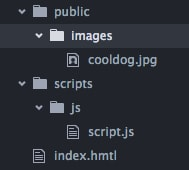

# Gittin' to know Git
[Link to git command cheat sheet](./cheatsheet.md)


###### Don't worry if you don't git (sorry) everything right away, git can be *tricky*, especially at first! Students typically struggle with git and its mechanics for the first 3 weeks!

## Overview

In this lesson, we will learn the basics of using git and see how git is used with Github, a website for hosting and sharing code.

- Git is a wonderful tool that allows developers (that's us!) to collaborate
- Git has features that give us a safety net for experimenting and writing code, without breaking already working code

---

## Lesson Objectives

- Define **version control** and identify what problems it solves for developers
- Define a **repository** (aka *repo*) is, and identify what the parts of a **repo** are
- Differentiate between a **local repository** and a **remote repository** and their workflows
- Synchronize a **local repository** with a **remote repository** using **git** with **Github**

---

## *Lesson Framing* (10:00 - 10:10)

To jump off of the previous command-line interface lesson, let's take a quick look at how our files are organized. This will be important for conceptualize how repositories work.

### Example of a *File Tree*

Our projects might have a file structure that looks like this:

<details>
  <summary>
    <i>Click Triangle to Expand</i>
    <br>
    
  </summary>

  <p>
    
    <p>
      <i>This is also our </i><b>working tree</b>, <i>the tree of files within the </i><b>working directory</b>.
    </p>
  </p>
</details>

### File Tree Relationships & Terminology
- top_level_folder is our **working directory**
- top_level_folder has 2 **child** folders, *scripts* and *public*
- *scripts* and *public* each also have 1 **child** folder
- *js* has a **parent directory**, *scripts*, just as *images* does with *public*.

### What Version Control Is

Simply put, version control is a way of *tracking changes* made to a file or group of files over time.

It's very likely that each of us has tried to keep track of changes made to a file by creating different versions of that file. This however can be messy or complicated.

Let's look at some questions that hint at potential complications of having multiple or many versions of a file. Turn to the person next to you to collaborate on responding to the questions below. We'll discuss for 5 minutes and then share our responses.

#### Think Pair Share (10:10-10:20)

Turn to the person next to you and discuss the questions below. After 5 minutes of discussion we'll share answers with the class.

- Why might we want to have different versions of a file?
- What strategies have you used to keep track of changes you've made to a document or file before? If you haven't, brainstorm ways you might keep track of different versions of a file/document.
- How well did that strategy work? Was it painful? Can you see any limitations or problems associated with that strategy?
- How might that approach work in a team environment?
- If you collaborated with other people on a document with multiple versions, how did it go? Did it feel cumbersome to coordinate?

Luckily, we have a specialized tool called git that does a much better job of tracking changes with files.

### So what does Git do? (10:20 - 10:30)

#### *Framing* Problems that Git Solves

- I wrote some code to implement a feature, but I broke a bunch of stuff in the process.
**I want to be able to go back in time to a point where my code works!**

- I'm trying to see how my codebase or some files have changed over time.
**I'd like to be able to compare various <i> states </i> of my files.**

- I want to work on someone else's project, but don't want to break their code and ruin everything.
**I want to have my own 'area' where I can try out code or build out a feature without adversely affecting another developer's project I'm working on.**

- I'm working on a project with a team, and **I want to have an easy way to collaborate with my team**

#### What Git is & how Git allows us to solve these problems

- **Git** is version control software; We'll be using **git** in the command line.

- With git, we can go back to different 'save-points' or ***commits***.

- **Commits** are like snapshots of projects (a group of files) that get stored in a **repository**.

- We have to make **commits** in the first place to be able to go back to them. Each **commit** has a **commit message** that summarizes the changes made to a file or group of files.

  - Making ***commits*** after getting a small feature to work is a great practice. If you go an hour without committing, it's usually best to go ahead and commit what you have gotten to work in the last hour.

  - **Commit Early, Commit Often!**

- The ability to go back to previous commits gives us a lot of room to experiment.
It's not only wonderful but *absolutely essential* to have this kind of safety net as a developer!

- When collaborating on a project with other developers, *git* gives us tools to create our own 'area' for writing code, within that project.

  This 'area' is called a ***branch***. Another use-case for creating your own **branch** is for refactoring (or re-writing) working code in order to improve it.
  We'll cover **branching** in-depth with the next lesson on *git*.

Now that we've talked at a high level about what problems git solves and what features it provides, let's break down some of the terminology.

---

### A Metaphor for the Git Repo (10:30-10:40)

https://www.youtube.com/watch?v=LVAkxmZqNNE

After watching the video, let's think for a second about what the video is made up of.

### Relating this to the repo

Instead of a series of images of some dude's face, with ***git***, we're taking snapshots of a file or files used in a project. Together, all these snapshots together are stored in our **repo**. Not only is it like a filing-cabinet, but it can travel backwards or forwards in time and store these snapshots as **commits**.

### The Git Repository (or Git Repo)

A ***repository*** is like a special kind of filing cabinet that stores a bunch of snapshots of a project taken at different points the project's development. It is made out of **commits**, which are snapshots of a file tree, as the file tree changes over time.

Repos are also highly 'aware' of changes made within them; it can detect when files have been added or changed.

We're used to thinking about files stored on the computer in terms of files & folders. Our projects, and actually all files on a computer are contained in structures called ***file trees***.


  - What changes are our **repos** tracking?
  - How are these changes recorded?
  - What is a **repo** 'made out of'?

---

### Anatomy of a Repo: Commits and Repositories (10:40 - 10:50)

When we create save-point or a ***commit***, we're saving our project's **file tree** in its current state. A repo is essentially made up of **commits**, just as a filing cabinet is 'made up of' files.


#### Terminology

* **commit** - a snapshot of the working tree at a given time (along with a message explaining what changed)
* **the index** - also called the staging area; where we add changes we to a commit
* **HEAD** - what is currently "checked out" in the repo
* **status** - what files have changed, and what state they are in.
  * try typing `git status` within a directory containing a repository


- Repo is made out of **commits**
- The staging area is where we add files to be committed
  - `git add <filename>`
- After we have added our file(s) to the staging area, we can commit them with `git commit -m "<commit message>"` This is the step that actually creates the save-point or **commit**
- If I pick out a random photo from the stack (above the word "REPO"), this is like the **HEAD** checking out that specific snapshot or commit. If we check out a previous commit, we are moving the **HEAD** to that commit. This also happens when we check out a **branch**, which we will cover in the follow-up mini-lesson.

Let's see some of these mechanics in action. After seeing a demo of the pattern of adding a file and committing (`git add`, `git commit`), we'll jump into a short exercise.

### Exercise 1: Create a Repository and Committing Locally - We Do (5 minutes)

1. Create a new `resume` folder in sandbox directory.
2. Change your working directory to `resume`.
  - ```cd resume```
3. Initialize a git repository in the `resume` folder.
  - ```git init```
4. Create a resume.txt file and write anything in it.
  - save it!
5. Make an initial commit with the current version of their code (all files) (remember to ```add``` and then ```commit```)

[What makes a great commit message?](http://tbaggery.com/2008/04/19/a-note-about-git-commit-messages.html)

#### Exercise 1.5: More Commits / History - You Do (5 minutes)

1. Modify resume.txt and create a new file (add something to it!). Then create a new commit, with an appropriate message
2. Repeat previous step (committing) but this time, change two files.
3. View the **commit history** by running `git log` to see the log of commits, and what changed

<summary>
  TROUBLESHOOTING: If you've initialized the git repository in your sandbox
<details>
If you've initialized the git repository in your sandbox folder instead of the resume folder, try running:
  <ul>
    <li>
      ```rm -rf .git```
    </li>
    <li>
      MAKE SURE YOU DONT FORGET `.git` IF YOU DO THIS
    </li>
  </ul>
</details>
</summary>


#### Git History & Verifying Our Commits

```
$ git log
```

As your commit history grows more complex, the default output of git log will not be very useful. To improve your `git log` experience, try this alias our instructor Jesse created `gl`:


```
$ curl http://www.wdidc.org/~jesse/gl >> ~/.bash_profile
$ source ~/.bash_profile
$ gl
```

### Break (10 min)

## *Section II Framing*: Local and Remote (11:00-11:10)

In the last exercise, we were working locally, on files stored our harddrives. Very often, we are going to want to push the changes we have made to a remote repo, for example, when we submit WDI homework or want to share our code with our colleagues. We're going to take an in-depth look at local and remote workflows.

### Git Local Workflow

Working on a project w/ git revolves around the basic **edit/stage/commit** pattern.

#### Summary

1. Edit your files in the **working directory** and save them in your text editor.
2. Use `git add <file1> <file2>` to add them to the **staging area**.
3. Use `git commit -m "descriptive message"` to make a **commit** of that which is staged in the **repo**.
4. Lather. Rinse. Repeat.

#### Detailed Description

First, you edit your files in the working directory. When you’re ready to save a copy of the current state of the project, you stage changes with git add. After you’re happy with the staged snapshot, you commit it to the project history with git commit.

This means that `git add` needs to be called every time you alter a file.

The **staging area** is one of Git's more unique features, and it can take some time to wrap your head around it. It helps to think of the **staging area** as a buffer between the working directory and the project history.

Instead of automatically committing all of the changes you've made since the last commit, the **stage** lets you group *related changes* into highly focused snapshots before actually committing it to the project history. This means you can make all sorts of edits to unrelated files, then go back and split them up into logical commits by adding related changes to the stage and commit them piece-by-piece. If you change 3 files to implement a certain feature, or fix a certain bug, you'd add those 3 files to the staging area `git add <file1> <file2> <file3>`, then a commit `git commit -m "fixes bug <where thing does not work>"` or `git commit -m "adds <some> feature"`

The git commit command commits the staged snapshot to the project history. Committed snapshots can be thought of as “safe” versions of a project—Git will never change them unless you explicitly ask it to. Along with `git add`, `git commit` is one of the most important Git commands.

## Remote Repositories and Github

So far we've been doing everything on our own machine, or **locally**.

### Terms and Concepts for Remotes

#### Documentation Dive Exercise (11:10 - 11:20)

Documentation takes time to be able to read, it's not easy at first to be able to extract what you need to know. Documentation can vary in readability; some documentation will be particularly difficult to read through for beginners. But with this exercise, we'll get some early practice.

Let's take a brief look over provided reading on [Git Remotes](https://git-scm.com/book/en/v2/Git-Basics-Working-with-Remotes)
and prepare to define the key terms below (read through pushing remotes).

Pair with a partner and spend 5 minutes reading through the documentation above, picking 2 or 3 terms to define. Afterwards, we'll spend 5 minutes discussing our findings.

#### Key Terms to Define
* **remote**
* **github**
* **clone**  
* **fetch**
* **merge**  
* **pull**   
* **push**   
* **merge conflict**

<details>
  <summary>
  Answer Key
  </summary>
  <ul>
    <li> **remote** - another repository that can be synchronized with a remote
    </li>
    <li> **github** - a service that hosts git remote repositories, and provides a web app to interact / collaborate on them
    </li>
    <li> **clone**  - download an entire remote repository, to be used as a local repository
    </li>
    <li> **fetch**  - downloading the set of changes (commits) from a remote repository
    </li>
    <li> **merge**  - taking two histories (commits), and merge them automatically if possible
    </li>
    <li> **pull**   - fetching changes and merging them into the current branch (a combo of `git fetch` and `git merge`)
    </li>
    <li> **push**   - sending changes to a remote repository and merging them into the specified branch
    </li>
    <li> **merge conflict** - when two commits conflict, and thus can't be merged automatically.
    </li>
  </ul>
</details>

### Creating your own remote repo

In this section, we'll learn to push changes made **locally** to our **remote** repo, hosted on our GitHub account.


### Exercise 2: Publish to a remote repository on Github (11:20-11:40)

The first step is to make sure you have ssh keys set up with GitHub so you don't have to type your password each time you want to push code:

```
ssh -T git@github.com
```

You should see a response like:

```
Hi <username>! You've successfully authenticated, but GitHub does not provide shell access.
```

If you get `Permission Denied`, please reference https://github.com/ga-wdi-lessons/git-ssh

Once you've configured your SSH Keys with Github:

1. Make sure you are in the resume directory and you have nothing to commit.
2. Ensure you have at least one commit (`git log` to verify)
3. Create a github repo
  - To create a repo, click on the '+' at the top right of your Github profile
4. Give the repo a name and description, and ensure it's public
  - Don't worry about the other selections
5. Follow the steps provided to add repo as a remote and push to remote
  - NOTE: there are 3 options for setting up your repo. take a second to think about which commands you need here
  - Is the repository on your LOCAL already existing?
6. Open the repo on github, and explore the code there
7. Make a change locally, commit it, and push it
8. Open the repo on github, and note that the changes have synced

## Break (11:40-11:50)

## Forking & Pull Requests (11:45 - 12:30)

#### Terms and Concepts (Forking and Pull Requests)

* **fork** - make a copy of a repo on GitHub under a different account, used for open-source software (OSS) collaboration
  * **This happens only once**
* **cloning** - make a copy of a remote repo locally, or on your  machine
  * **This too, happens only once**
* **pull request** - a github feature which allows a user to suggest and discuss changes to a repo they have forked

Below is a step by step illustration of how the forking and cloning process works.

##### 1. A Remote Repo (Our HW in this case)

##### 2. Forking the Repo to our Github account

##### 3. Cloning to our Local Machine

##### 4. Pushing to a Remote, the Forked Repo on our GH account

##### 5. Creating a Pull Request and Pulling Changes from the original source repo


##### GIF Recap


### Demo

Next I'll demo this process, by forking GA's classroom management tool, Garnet.

Demo forking / cloning / PR for [Garnet](github.com/ga-dc/garnet)


## Bonus Material

Anyone missing the git branch `(master)` in their bash prompt?

https://git-scm.com/book/en/v2/Git-in-Other-Environments-Git-in-Bash

Check out the Pro Git book - available for free online! https://git-scm.com/book/en/v2

### Bonus Exercise 3: Reset your work
What if you staged some work and realize you don't want that saved? Or, what if you've gone even further and committed something, but want to revert back to the last commit?

1. make a few changes to your resume.txt file
2. stage those files, but do NOT commit
3. check your ```git status```
4. try reverting that file back to before it was staged, what happens when you run ```git status``` again?
  * ```git reset head```
5. make a new change to your resume.txt file, and this time ```add``` and ```commit``` it
6. can you still revert with the same command?
7. try ```git reset head^```
  * ***note, be VERY careful when reseting! you cannot undo if you go back a commit***
  - this will return the changes you made to be untracked
8. to completely undo the changes, run ```git checkout -- resume.txt``` after ```git reset head^```


### Closing

- Why is version control important for developers?
- What problems do we anticipate using git / github?
- Differentiate between git as a tool, and github as a service
- Define and differentiate between forking and cloning

## Quiz Questions

1. What are the main components of a git repository and how do they relate?
2. Describe the steps of the process for contributing to open source software on
   Github (the same as our homework submission process).


## Homework

### 1. Visit the [haiku](https://github.com/ga-dc/haiku) repo and follow the instructions there.

In the comments of the Pull Request description, please include a block like so (numbers out of 5):

```
comfort_level: 4
completeness: 5
```


## Resources

* [Interactive Git Cheetsheet](http://ndpsoftware.com/git-cheatsheet.html)
* [Syncing with Git](https://www.atlassian.com/git/tutorials/syncing/)
* [Github Guides](https://guides.github.com)
* [Github Training](https://training.github.com/kit/)
* [Git Immersion - Interactive Course](http://gitimmersion.com/lab_05.html)
* [Pro Git](http://git-scm.com/book/en/v2) - An in-depth free PDF book for those wanting to understand git deeper
* [GitUp - Interactive Commit Visualizer](http://gitup.co)
* [Practice with Git](https://github.com/grayghostvisuals/practice-git)


## Appendix - Git CLI Commands

### Creating Repositories

* `git init` - run this command in a folder to turn it into a git repository
  * note: don't init a repo inside an existing repo! (also don't init in your home folder)
OR
* `git clone <URL>` - download (clone) a repo from github (or other remote source)

### Linking an existing repo to github

1. Create the repo on github.com (make sure not to check the 'initialize with readme').
2. Follow the instructions on the new repo's webpage to add as a remote:
3. Change directories to the local repo
  * `cd ~/path/to/repo`
4. Add the github remote, and name it 'origin':
  * `git remote add origin <URL>`
5. Push the existing commits up to the remote called 'origin' , and set it to track master branch:
  * `git push -u origin master`

Once linked, you can just run `git push` to push master branch to master branch

### Committing

1. Add the files you want to commit to the index (equivalent to checking which files you want to commit in the Github GUI app)
  * `git add file1 file2 ...`, or `git add .` will add all changes in the current folder
2. Create the commit:
  * `git commit -m "description message for commit"`
  * if you omit the `-m` and message, then git will open an editor for you to write the message in

### Syncing with a remote (push/pull)

1. `git pull [remote] [branch]` - fetch and merge changes (from the origin and branch specified) and merge them into the current branch.
  * If origin and branch aren't specified, git will default to the tracking branch (usually origin and the remote branch with the same name as the current branch).
  * If no origin/branch are specified, and no tracking branch is set up, git may tell you to specify
2. 'git push [remote] [branch]' - push and merge local changes from the current branch to the specified branch on the remote repo and branch specified.
  * Same rules apply as `git pull` above.


### [The Homework Submission Process](https://vimeo.com/167925651)


### Optional Bonus assignments:
* Create a blog site using jekyll (hosted using a separate repo at **your_github_username*.github.io/blog, this is called a 'project' rep)
* Register for a custom domain name (usually $6 - $10 a year), and associate it with your github project site

You'll find instructions that will help at the bottom of the [github pages guide](https://pages.github.com).**
